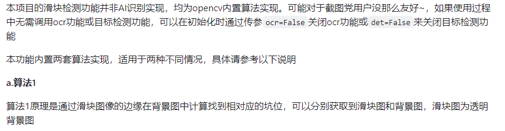
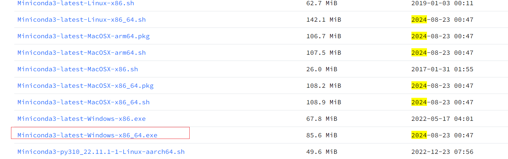
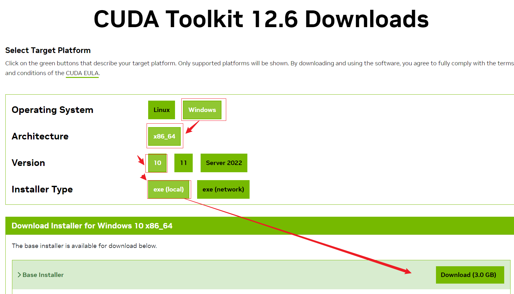
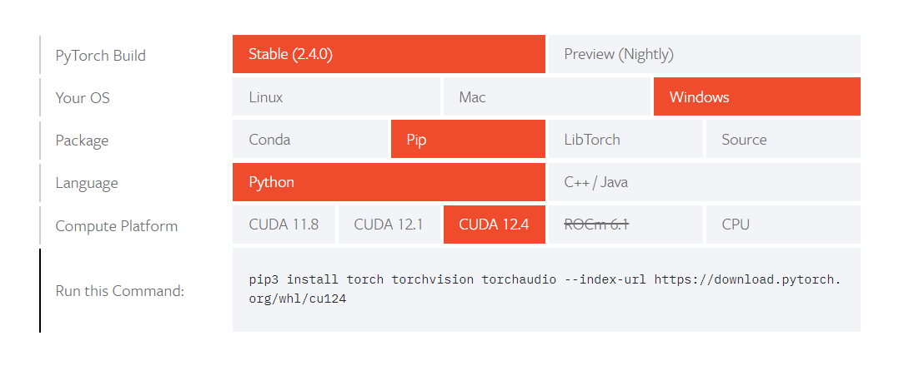
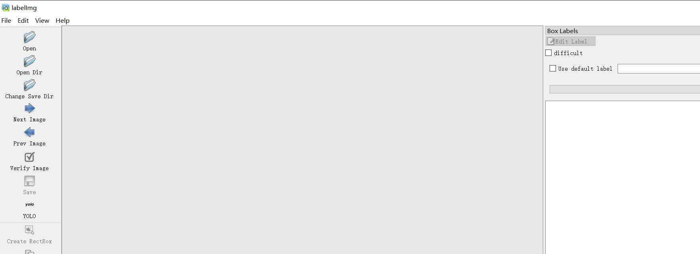
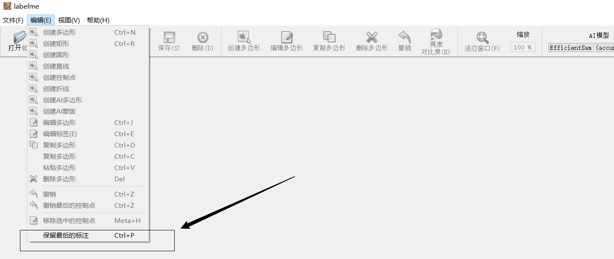

## 声明：本教程只能用于教学目的，如果用于非法目的与本人无关

# 滑动验证码

## 1.前言

​	滑动验证码是一种常见的用户验证方式，通常用于防止自动化程序（如机器人）恶意访问网站。滑动验证码的基本原理是用户需要将一个滑块拖动到特定位置以完成验证，目的是验证用户的行为是人工操作而非自动化脚本。

滑动验证码的工作流程通常包括以下步骤：

1. **验证码生成**：系统生成一个带有滑块和背景图片的验证码界面。背景图片通常包含一个缺口，而滑块是与缺口形状匹配的小块图像。
2. **用户操作**：用户将滑块拖动到背景图片的缺口处。如果滑块与缺口精确对齐，则验证通过；否则，验证失败。
3. **验证机制**：
   - **前端验证**：前端根据用户的操作判断滑块是否对齐。
   - **后端验证**：在滑块对齐后，前端会将验证数据发送给服务器，服务器通过算法再次确认用户操作的有效性。
4. **处理结果**：如果验证通过，用户可以继续进行后续操作；如果验证失败，系统可能要求用户重新进行验证或提供其他验证方式。

​	滑动验证码的优势在于能够有效防止简单的自动化攻击，因为它需要人工操作才能完成验证。然而，随着技术的发展，某些高级自动化脚本可能依然能够通过滑动验证码，因此这类验证码常常与其他验证机制（如文字验证码、短信验证等）结合使用以增强安全性。

> 某验：
>
> ​	有混淆的背景图案，混淆的类似拼图，但是缺口明显
>
> 
>
> 某易：
>
> ​	滑块和缺口有白色的混淆，简单
>
> 
>
> 某美：
>
> ​	背景和缺口对比明显，但是有对应的混淆的滑块小图
>
> 
>
> 某象：
>
> ​	背景和缺口混淆一般，滑块和正确的缺口特征明显
>
> 

## 2.ddddocr方案

> 网址：https://github.com/sml2h3/ddddocr
>
> 安装：pip install ddddocr
>
> 使用说明：
>
> 

```python
import ddddocr  # 导入 ddddocr 库，用于滑块验证码的目标检测
import cv2  # 导入 OpenCV 库，用于图像处理和显示

# 定义一个函数，用于显示背景图像并在匹配到的目标位置绘制矩形框
def cv_show(bg_path, res):
    # 读取背景图像
    img = cv2.imread(bg_path)
    # 在匹配到的位置绘制一个矩形框
    # res['target'] 包含了匹配到的目标的坐标 [x1, y1, x2, y2]
    cv2.rectangle(img,
                  (res['target'][0], res['target'][1]),  # 左上角坐标
                  (res['target'][2], res['target'][3]),  # 右下角坐标
                  (0, 255, 0),  # 颜色为绿色
                  2)  # 线条宽度为 2 像素
    # 显示结果图像
    cv2.imshow("res", img)
    # 等待用户按键，随后关闭窗口
    cv2.waitKey(0)

# 初始化 ddddocr 的滑块验证码匹配模型，禁用字符检测和OCR功能
det = ddddocr.DdddOcr(det=False, ocr=False)

# 背景图像路径
bg_path = "bg6.jpg"

# 打开并读取目标图像（滑块）文件
with open('target6.png', 'rb') as f:
    target_bytes = f.read()

# 打开并读取背景图像文件
with open(bg_path, 'rb') as f:
    background_bytes = f.read()

# 使用 ddddocr 进行滑块验证码匹配，获取匹配结果
res = det.slide_match(target_bytes, background_bytes,simple_target=True)

# 打印匹配结果，res 是一个包含匹配位置等信息的字典
print(res)

# 调用自定义函数 cv_show，在背景图像上绘制匹配到的目标矩形框，并显示
cv_show(bg_path, res)

```


## 3.opencv方案

> ​	使用opencv打开图片，然后把目标图片用模板匹配的方式在背景图上查找。因为全匹配干扰比较大，所以采用canny找到图像的边缘，用边缘匹配，准确率高

```python
import cv2

# 定义一个函数用于在图像上绘制矩形框，并显示结果
def cv_show_target(img, x1, y1, x2, y2):
    # 在图像上绘制矩形框，颜色为绿色，线条宽度为2
    cv2.rectangle(img, (x1, y1), (x2, y2), (0, 255, 0), 2)
    # 显示处理后的图像
    cv2.imshow("res", img)
    # 等待用户按键继续
    cv2.waitKey(0)
    # 关闭所有显示的窗口
    cv2.destroyAllWindows()

# 定义一个函数用于显示图像
def cv_show(img, title="img"):
    # 显示图像
    cv2.imshow(title, img)
    # 等待用户按键继续
    cv2.waitKey(0)
    # 关闭所有显示的窗口
    cv2.destroyAllWindows()

# 加载背景图像
bg = cv2.imread('bg6.jpg')
# 检查图像是否成功加载
if bg is None:
    print("Error: bg.png 加载失败")
else:
    cv_show(bg, "bg")  # 显示背景图像

# 加载目标图像
target = cv2.imread('target6.png')
# 检查图像是否成功加载
if target is None:
    print("Error: target.png 加载失败")
else:
    cv_show(target, "target")  # 显示目标图像

# 对背景图像和目标图像进行边缘检测
bg_canny = cv2.Canny(bg, 70, 200)
target_canny = cv2.Canny(target, 70, 200)
# 显示边缘检测结果
cv_show(bg_canny, "bg_canny")
cv_show(target_canny, "target_canny")

# 在背景图像中查找与目标图像匹配的区域
res = cv2.matchTemplate(bg_canny, target_canny, cv2.TM_CCOEFF_NORMED)
# 获取匹配结果的最小值、最大值及其位置
min_val, max_val, min_loc, max_loc = cv2.minMaxLoc(res)

# 打印匹配度，最大值越接近1表示匹配度越高
print(f"匹配度: {max_val}")

# 获取目标图像的尺寸（高度和宽度）
height, width = target.shape[:2]

# 计算矩形框的左上角和右下角坐标
x1, y1 = max_loc[0], max_loc[1]
x2, y2 = x1 + width, y1 + height

# 在背景图像上绘制匹配区域的矩形框，并显示最终结果
cv_show_target(bg, x1, y1, x2, y2)

```


## 4.yolo方案

### 4.1 环境配置

> python	3.9	https://www.python.org/
>
> 推荐安装miniconda，创建3.9的环境
>
> miniconda 	https://mirrors.tuna.tsinghua.edu.cn/anaconda/miniconda/
>
> 
>
> 添加pip源	pip config set global.index-url https://pypi.tuna.tsinghua.edu.cn/simple
>
> cuda下载	https://developer.nvidia.com/cuda-downloads?target_os=Windows&target_arch=x86_64&target_version=10&target_type=exe_local
>
> 
>
> pytorch安装	https://pytorch.org/get-started/locally/
>
> cuda 12.1和cuda12.4都一样
>
> 
>
> yolov8	https://github.com/ultralytics/ultralytics
>
> pip install ultralytics

### 4.2 数据收集

> ​	get_uuid是为了多个爬虫同时抓数据保存时，图片不会重名。其他就是定位，截图保存，刷新。仅供参考

```python
import time
import uuid
from playwright.sync_api import sync_playwright

def get_uuid():
    """
    生成一个不带短横线的UUID字符串。
    
    :return: 一个32字符长度的UUID字符串
    """
    uuid_str = str(uuid.uuid4()).replace('-', '')  # 生成UUID并移除短横线
    return uuid_str

# 初始化图片计数器
num = 0

# 使用Playwright启动浏览器并抓取网页内容
with sync_playwright() as p:
    # 启动Chromium浏览器，headless=True表示无头模式，即不显示浏览器界面
    browser = p.chromium.launch(headless=True)
    page = browser.new_page()  # 创建一个新页面
    page.goto('需要抓取的网址')  # 访问目标网址

    # 点击网页中的特定元素（根据XPath定位）
    page.locator('xpath=/html/body/div[1]/div[2]/div/div[6]/div/div[2]/div[1]/div/ul/li[2]').click()
    time.sleep(2)  # 等待2秒，确保页面加载完成

    page.locator('xpath=/html/body/div[1]/div[2]/div/div[6]/div/div[2]/div[2]/div[2]/ul/li[2]/div[2]/div/div[1]').click()
    time.sleep(2)  # 再次等待2秒

    # 开始循环抓取图片
    while True:
        try:
            for i in range(5):  # 每次抓取5张图片
                print("抓取的图片数量：{}".format(str(num)))  # 输出当前抓取的图片数量
                uuid_str = get_uuid()  # 生成唯一的文件名
                
                # 截图并保存图片，路径中使用UUID命名文件
                page.locator('xpath=/html/body/div[11]/div/div[3]/div/div[2]/div[1]/div[2]/canvas').screenshot(
                    path="./images/{}.png".format(uuid_str)
                )
                
                # 点击下一张图片的按钮
                page.locator('xpath=/html/body/div[11]/div/div[3]/div/div[4]/div[2]/span[2]/img').click()
                
                num += 1  # 图片计数器加1
                page.mouse.move(0, 0)  # 移动鼠标到页面的(0, 0)位置，可能是为了触发一些页面事件
                time.sleep(2)  # 等待2秒

            # 刷新页面，并重复抓取操作
            page.reload()  # 刷新页面
            time.sleep(3)  # 等待3秒，确保页面刷新完成
            
            # 重新点击网页中的特定元素
            page.locator('xpath=/html/body/div[1]/div[2]/div/div[6]/div/div[2]/div[1]/div/ul/li[2]').click()
            time.sleep(2)  # 等待2秒
            
            page.locator(
                'xpath=/html/body/div[1]/div[2]/div/div[6]/div/div[2]/div[2]/div[2]/ul/li[2]/div[2]/div/div[1]').click()
            time.sleep(2)  # 再次等待2秒

        except Exception as e:  # 捕捉异常
            print("err:", e)  # 打印错误信息
            print("出错了，重新启动浏览器！")
            time.sleep(5)  # 等待5秒

            # 关闭当前浏览器，并重新启动
            browser.close()
            browser = p.chromium.launch(headless=True)  # 重启浏览器
            page = browser.new_page()  # 创建新页面
            page.goto('需要抓取的网址')  # 重新访问目标网址
            
            # 重新执行点击操作，定位并点击特定元素
            page.locator('xpath=/html/body/div[1]/div[2]/div/div[6]/div/div[2]/div[1]/div/ul/li[2]').click()
            time.sleep(2)
            page.locator(
                'xpath=/html/body/div[1]/div[2]/div/div[6]/div/div[2]/div[2]/div[2]/ul/li[2]/div[2]/div/div[1]').click()
            time.sleep(2)
    
    page.pause()  # 暂停页面，供调试用

```

### 4.3 数据去重

> ​	这一步比较重要，很多验证码图片，重复率很高。我这次做实验700多张，去重还是100多张。去重的原来是图片的md5值是一定的，变量目录下的图片，有一样的就删除。

```python
import os
import hashlib

def calculate_hash(file_path):
    """计算文件的MD5哈希值"""
    hasher = hashlib.md5()
    with open(file_path, 'rb') as f:
        # 分块读取文件，防止大文件占用太多内存
        while chunk := f.read(8192):
            hasher.update(chunk)
    return hasher.hexdigest()

def delete_duplicate_images(folder_path):
    """删除文件夹中的重复PNG图片"""
    hashes = {}  # 用于存储文件的哈希值
    duplicate_files = []  # 用于存储重复文件的路径

    # 遍历文件夹中的所有文件
    for root, _, files in os.walk(folder_path):
        for file_name in files:
            if file_name.endswith('.png'):
                file_path = os.path.join(root, file_name)
                file_hash = calculate_hash(file_path)

                # 如果哈希值已存在，表示该文件是重复的
                if file_hash in hashes:
                    duplicate_files.append(file_path)
                else:
                    hashes[file_hash] = file_path

    # 删除所有重复文件
    for file_path in duplicate_files:
        os.remove(file_path)
        print(f"删除重复文件: {file_path}")

# 使用示例：指定文件夹路径
folder_path = "images"  # 替换为你要操作的文件夹路径
delete_duplicate_images(folder_path)

```

### 4.4 重命名和resize

> ​	重命名是为了好区分图片，方便后面做分割训练集和验证集。resize图片的大小，是为了提高训练效果，让模型学习更多细节。

```python
import os
import cv2


def rename_and_resize_images(folder_path, new_size=(640, 640)):
    # 获取文件夹中的所有文件
    files = os.listdir(folder_path)
    img_count = 0  # 用于生成新文件名的计数器

    # 遍历文件夹中的所有文件
    for file_name in files:
        # 构造完整文件路径
        file_path = os.path.join(folder_path, file_name)

        # 检查是否为图片文件（你可以根据需要增加其他图片格式）
        if file_name.lower().endswith(('.png', '.jpg', '.jpeg')):
            # 读取图片
            img = cv2.imread(file_path)

            if img is not None:
                # 调整图片大小为640x640
                resized_img = cv2.resize(img, new_size)

                # 构造新的文件名，数字从0开始，文件格式保持不变
                new_file_name = f"{img_count}.png"
                new_file_path = os.path.join(folder_path, new_file_name)

                # 保存重新命名和调整大小后的图片
                cv2.imwrite(new_file_path, resized_img)

                # 删除原始文件
                os.remove(file_path)

                print(f"已处理并重命名: {file_name} -> {new_file_name}")

                # 更新计数器
                img_count += 1


# 使用示例：指定文件夹路径
folder_path = "images"  # 替换为你要操作的文件夹路径
rename_and_resize_images(folder_path)

```

### 4.5 标注数据

> ​	常用的标注工具有labelme和labelimg。
>
> ​	labelimg可以直接生成yolo格式的标签数据，方便数据打标，但是数据量比较大的时候非常繁琐。
>
> 
>
> ​	labelme不能直接生成yolo格式的标签数据，需要转换脚本。但是有保留最后标注点的功能，应对目标图案大小和数量不变时，特别方便，效率提升至少2-3倍。
>
> 

```python
import json
import os

# 定义输出目录，用于存放转换后的YOLO格式的标签文件
output_dir = './labels'

# 定义标签到类别编号的映射字典，例如 'target' 对应编号 0
label_to_id = {
    'target': 0,
}

def convert_labelme_to_yolo(json_file_path, output_dir, label_to_id):
    """
    将Labelme格式的JSON文件转换为YOLO格式的标签文件。

    :param json_file_path: JSON文件的路径
    :param output_dir: 输出YOLO标签文件的目录
    :param label_to_id: 标签到类别编号的映射字典
    """
    # 打开并读取Labelme的JSON文件
    with open(json_file_path, 'r', encoding='utf-8') as f:
        data = json.load(f)

    # 获取图片的宽度和高度
    image_width = data['imageWidth']
    image_height = data['imageHeight']

    # 获取标注对象列表
    annotations = data['shapes']

    # 生成输出TXT文件的路径，文件名与原JSON文件名相同，但扩展名为.txt
    output_file_path = os.path.join(output_dir, os.path.splitext(os.path.basename(json_file_path))[0] + '.txt')

    # 打开输出文件，准备写入YOLO格式的标签数据
    with open(output_file_path, 'w', encoding='utf-8') as out_file:
        for annotation in annotations:
            label = annotation['label']  # 获取标注的标签
            points = annotation['points']  # 获取标注的点列表

            # 计算标注框的最小和最大坐标
            x_min = min([p[0] for p in points])
            x_max = max([p[0] for p in points])
            y_min = min([p[1] for p in points])
            y_max = max([p[1] for p in points])

            # 计算标注框的中心点、宽度和高度，并归一化为相对于图像尺寸的比例
            x_center = (x_min + x_max) / 2 / image_width
            y_center = (y_min + y_max) / 2 / image_height
            width = (x_max - x_min) / image_width
            height = (y_max - y_min) / image_height

            # 获取标签对应的类别编号
            class_id = label_to_id.get(label, -1)

            # 检查标签是否存在于映射字典中
            if class_id == -1:
                print(f"标签 '{label}' 未在映射中找到。")
                continue

            # 写入YOLO格式的标签数据
            out_file.write(f"{class_id} {x_center} {y_center} {width} {height}\n")


def create_classes_file(output_dir, label_to_id):
    """
    创建一个classes.txt文件，记录所有的类别名称。

    :param output_dir: 输出classes.txt文件的目录
    :param label_to_id: 标签到类别编号的映射字典
    """
    # classes.txt文件的路径
    classes_file_path = os.path.join(output_dir, 'classes.txt')

    # 根据label_to_id字典生成classes.txt文件
    with open(classes_file_path, 'w', encoding='utf-8') as f:
        for label in sorted(label_to_id, key=label_to_id.get):
            f.write(f"{label}\n")


def main():
    """
    主函数，负责遍历所有JSON文件并执行转换操作。
    """
    # 获取"./labels_json"目录下的所有文件
    files = os.listdir("./labels_json")
    for file in files:
        json_file_path = "./labels_json/" + file  # 构造JSON文件的完整路径
        print(json_file_path)  # 输出当前处理的文件路径
        convert_labelme_to_yolo(json_file_path, output_dir, label_to_id)  # 调用转换函数

    # 创建classes.txt文件
    create_classes_file(output_dir, label_to_id)


# 判断当前是否为主模块，如果是，则执行main函数
if __name__ == '__main__':
    main()

```

## 5.谢谢支持

本人擅长极验，顶象，数美，网易易盾的验证码模型，商务合作加v:tomysky67 老杨


觉的我的教程对你有帮助，求求各位老板使劲打赏

